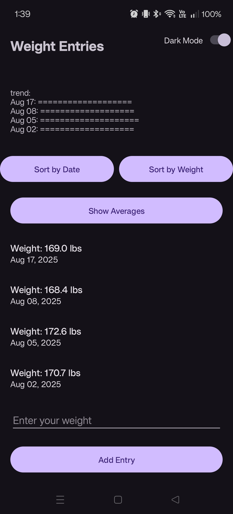

# Nicholas Pellegrini | CS Portfolio

## Computer Science Graduate | Android & Full Stack Developer

### Professional Self-Assessment
[View my Professional Self-Assessment](https://s1lent-her0.github.io/professional-self-assessment.html)

---

### Technical Skills
**Languages:** Java (Android), Python, C++, C, JavaScript, HTML/CSS, Bash, SQL  
**Frameworks & Platforms:** Android Studio, React, Node.js, Dash (Plotly), OpenGL, MERN Stack, PyMongo  
**Databases:** MongoDB, SQLite, Room Database, CRUD Operations  
**Tools & Concepts:** Git/GitHub, RESTful APIs, Client-Server Architecture, Data Structures & Algorithms, Debugging, Software Optimization, Technical Documentation  

---

## Featured Project: Weight Tracker App

### Key Features
- MVVM architecture with Room Database  
- LiveData observation for real-time updates  
- Background thread execution  
- Data visualization and sorting  

---

### Project Links
- [Live Portfolio Site](https://s1lent-her0.github.io/)  
- [Video Code Review](https://www.youtube.com/watch?v=Iqsa7Io-Vjs&t=208s)

---

### Enhancements
- **Enhancement 1:** [View App](https://s1lent-her0.github.io/) | [Software Design Narrative](https://s1lent-her0.github.io/enhancements/software-design-narrative.html)  
- **Enhancement 2:** [View App](https://s1lent-her0.github.io/) | [Algorithms Narrative](https://s1lent-her0.github.io/enhancements/algorithms-narrative.html)  
- **Enhancement 3:** [View App](https://s1lent-her0.github.io/) | [Databases Narrative](https://s1lent-her0.github.io/enhancements/databases-narrative.html)
- **Final:** [Final Branch](https://github.com/S1LENT-HER0/S1LENT-HER0.github.io/tree/final-eportfolio)  

---

### Connect
- [LinkedIn](https://www.linkedin.com/in/nicholas-pellegrini-21226b258)  
- [GitHub](https://github.com/S1LENT-HER0)
